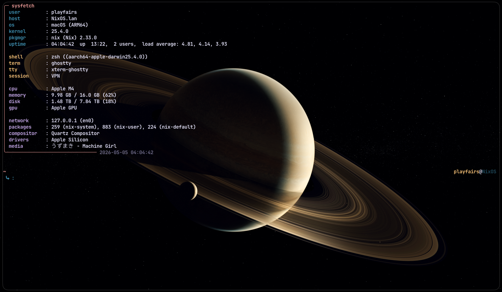

# sysfetch

A Minimal Fetching Utility.

---

>[!IMPORTANT]
> This tool is **NOT** properly optimized, it is 4:12 AM as I am typing this,
> I rushed this for bug fixes so I could push a stable version of it,
> it does not run instantly and needs to be fixed for quicker runtime,
> and other simple fixes. It also needs changes for configs, nerdfont icons and proper fetching for certain details.

## Screenshots

